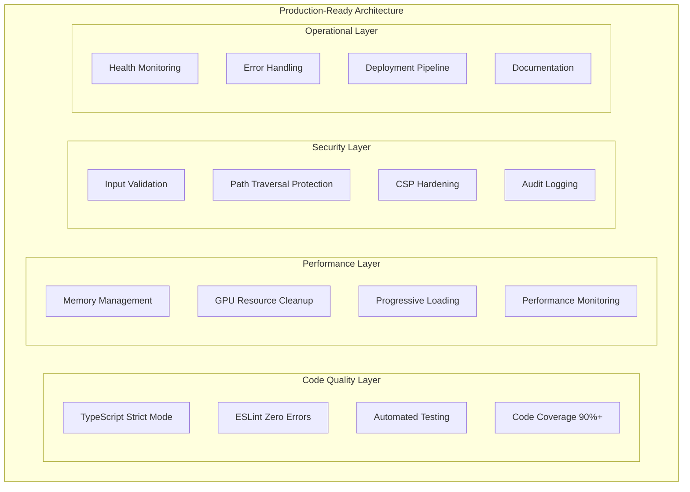
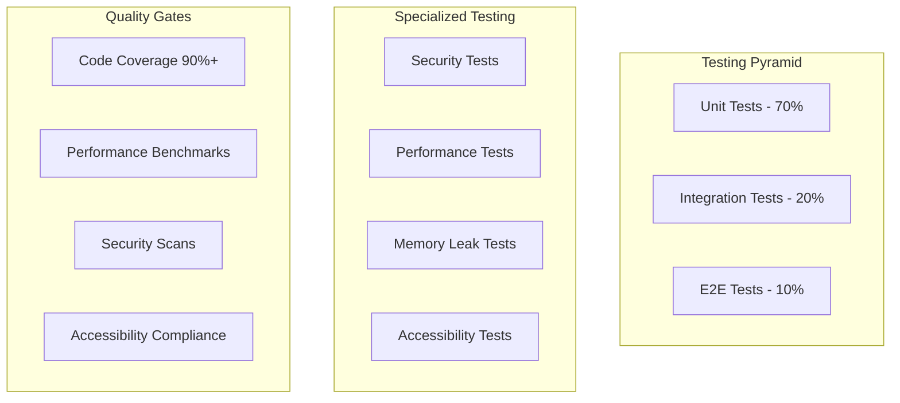

# Production Readiness Design Document

## Overview

This design document outlines the comprehensive technical approach to transform CircuitExp1 from its current state with 532 lint violations and critical issues into a production-ready application. The design addresses code quality, performance, security, and operational concerns through systematic refactoring and enhancement.

## Architecture

### Current State Analysis

**Critical Issues Identified:**
- 532 lint violations (10 errors, 522 warnings)
- 10 failed memory leak detection tests
- Parsing errors in security modules
- Extensive `any` type usage (100+ instances)
- Dead code accumulation
- Memory management issues in PixiJS rendering
- Inconsistent module patterns (CommonJS/ES modules)

**Architectural Strengths to Preserve:**
- Solid Electron security model with context isolation
- Comprehensive IPC validation framework
- Plugin architecture foundation
- Performance monitoring infrastructure
- Multi-platform build system

### Target Architecture



## Components and Interfaces

### 1. Code Quality Management System

**Purpose:** Establish and maintain code quality standards

**Components:**
- **TypeScript Configuration Manager**
  - Strict type checking enforcement
  - Custom type definitions for complex objects
  - Generic type utilities for common patterns

- **Lint Rule Engine**
  - Custom ESLint rules for project-specific patterns
  - Automated fix suggestions
  - Progressive error reduction tracking

- **Dead Code Elimination Service**
  - Unused export detection
  - Unreachable code identification
  - Automated cleanup recommendations

**Interface:**
```typescript
interface CodeQualityManager {
  validateTypeScript(): Promise<TypeScriptValidationResult>;
  runLintAnalysis(): Promise<LintAnalysisResult>;
  detectDeadCode(): Promise<DeadCodeReport>;
  generateQualityReport(): Promise<QualityReport>;
}

interface QualityReport {
  typeErrors: number;
  lintViolations: LintViolation[];
  deadCodeInstances: DeadCodeInstance[];
  coveragePercentage: number;
  qualityScore: number;
}
```

### 2. Memory Management System

**Purpose:** Eliminate memory leaks and optimize resource usage

**Components:**
- **Memory Leak Detector**
  - Real-time memory monitoring
  - Leak pattern identification
  - Automated cleanup triggers

- **GPU Resource Manager**
  - Texture lifecycle management
  - Context cleanup automation
  - Resource usage optimization

- **Progressive Loading Controller**
  - Chunked data processing
  - Virtual scrolling implementation
  - Memory-efficient rendering

**Interface:**
```typescript
interface MemoryManager {
  startMonitoring(): void;
  detectLeaks(): Promise<MemoryLeakReport>;
  cleanupResources(): Promise<void>;
  optimizeMemoryUsage(): Promise<OptimizationResult>;
}

interface MemoryLeakReport {
  leakDetected: boolean;
  growthRate: number;
  suspiciousObjects: string[];
  recommendations: string[];
}
```

### 3. Security Hardening System

**Purpose:** Implement comprehensive security measures

**Components:**
- **Input Validation Engine**
  - Schema-based validation
  - Sanitization pipelines
  - Attack pattern detection

- **Path Security Manager**
  - Traversal attack prevention
  - Directory access control
  - Path normalization

- **CSP Policy Manager**
  - Dynamic policy generation
  - Nonce management
  - Violation reporting

**Interface:**
```typescript
interface SecurityManager {
  validateInput(input: unknown, schema: ValidationSchema): ValidationResult;
  checkPathSecurity(path: string): PathSecurityResult;
  enforceCSP(policy: CSPPolicy): void;
  auditSecurityEvent(event: SecurityEvent): void;
}

interface ValidationResult {
  valid: boolean;
  sanitizedValue?: unknown;
  violations: SecurityViolation[];
}
```

### 4. Performance Optimization System

**Purpose:** Ensure optimal application performance

**Components:**
- **Rendering Performance Manager**
  - Frame rate monitoring
  - Culling optimization
  - Level-of-detail management

- **Data Processing Optimizer**
  - Batch processing implementation
  - Worker thread utilization
  - Caching strategies

- **Resource Usage Monitor**
  - CPU utilization tracking
  - Memory usage analysis
  - I/O performance monitoring

**Interface:**
```typescript
interface PerformanceManager {
  monitorFrameRate(): Promise<FrameRateMetrics>;
  optimizeRendering(nodeCount: number): RenderingStrategy;
  processDataBatch(data: unknown[]): Promise<ProcessingResult>;
  generatePerformanceReport(): Promise<PerformanceReport>;
}

interface PerformanceReport {
  averageFrameRate: number;
  memoryUsage: MemoryMetrics;
  processingTimes: ProcessingMetrics;
  recommendations: OptimizationRecommendation[];
}
```

## Data Models

### Code Quality Models

```typescript
interface LintViolation {
  file: string;
  line: number;
  column: number;
  rule: string;
  severity: 'error' | 'warning' | 'info';
  message: string;
  fixable: boolean;
}

interface TypeScriptError {
  file: string;
  line: number;
  column: number;
  code: number;
  message: string;
  category: 'error' | 'warning' | 'suggestion';
}

interface DeadCodeInstance {
  file: string;
  line: number;
  type: 'unused-export' | 'unused-variable' | 'unreachable-code';
  identifier: string;
  confidence: number;
}
```

### Performance Models

```typescript
interface MemoryMetrics {
  heapUsed: number;
  heapTotal: number;
  external: number;
  arrayBuffers: number;
  rss: number;
  timestamp: number;
}

interface RenderingMetrics {
  frameRate: number;
  drawCalls: number;
  textureMemory: number;
  vertexCount: number;
  culledObjects: number;
}

interface ProcessingMetrics {
  scanDuration: number;
  filesProcessed: number;
  directoriesProcessed: number;
  averageFileSize: number;
  processingRate: number;
}
```

### Security Models

```typescript
interface SecurityEvent {
  id: string;
  timestamp: Date;
  type: SecurityEventType;
  severity: SecuritySeverity;
  source: string;
  details: Record<string, unknown>;
  resolved: boolean;
}

interface PathSecurityResult {
  allowed: boolean;
  normalizedPath?: string;
  violations: PathViolation[];
  riskLevel: 'low' | 'medium' | 'high' | 'critical';
}

interface CSPViolation {
  directive: string;
  blockedURI: string;
  violatedDirective: string;
  originalPolicy: string;
  timestamp: Date;
}
```

## Error Handling

### Error Classification System

```typescript
enum ErrorCategory {
  CRITICAL = 'critical',      // Application crash, data loss
  HIGH = 'high',             // Feature failure, security issue
  MEDIUM = 'medium',         // Performance degradation
  LOW = 'low',               // Minor UI issues
  INFO = 'info'              // Informational events
}

interface ErrorHandler {
  handleError(error: Error, category: ErrorCategory): Promise<void>;
  recoverFromError(error: Error): Promise<boolean>;
  reportError(error: Error, context: ErrorContext): Promise<void>;
}
```

### Recovery Strategies

1. **Memory Exhaustion Recovery**
   - Automatic garbage collection triggering
   - Progressive data unloading
   - User notification with options

2. **GPU Context Loss Recovery**
   - Automatic context recreation
   - Texture reloading
   - Rendering pipeline restart

3. **File System Error Recovery**
   - Alternative path resolution
   - Permission escalation requests
   - Graceful degradation

## Testing Strategy

### Test Architecture



### Test Implementation Plan

1. **Unit Test Enhancement**
   - Increase coverage from current ~60% to 90%
   - Mock external dependencies
   - Test error conditions thoroughly

2. **Integration Test Development**
   - IPC communication testing
   - File system operation testing
   - Security boundary testing

3. **Performance Test Suite**
   - Memory leak detection automation
   - Rendering performance benchmarks
   - Large dataset processing tests

4. **Security Test Framework**
   - Input validation testing
   - Path traversal attack simulation
   - CSP violation testing

### Quality Gates

```typescript
interface QualityGate {
  name: string;
  threshold: number;
  current: number;
  passing: boolean;
  blocker: boolean;
}

const QUALITY_GATES: QualityGate[] = [
  { name: 'Code Coverage', threshold: 90, current: 0, passing: false, blocker: true },
  { name: 'Lint Violations', threshold: 0, current: 532, passing: false, blocker: true },
  { name: 'Memory Leak Tests', threshold: 100, current: 47, passing: false, blocker: true },
  { name: 'Security Vulnerabilities', threshold: 0, current: 0, passing: true, blocker: true },
  { name: 'Performance Benchmarks', threshold: 100, current: 85, passing: false, blocker: false }
];
```

## Implementation Phases

### Phase 1: Foundation Cleanup (Weeks 1-2)
- Fix all parsing errors and critical lint violations
- Implement strict TypeScript configuration
- Remove dead code and unused dependencies
- Establish automated quality gates

### Phase 2: Memory and Performance (Weeks 3-4)
- Fix memory leak issues in rendering pipeline
- Implement progressive loading for large datasets
- Optimize GPU resource management
- Add performance monitoring and alerting

### Phase 3: Security Hardening (Weeks 5-6)
- Implement comprehensive input validation
- Harden CSP policies for production
- Add security event monitoring
- Complete security audit and penetration testing

### Phase 4: Testing and Documentation (Weeks 7-8)
- Achieve 90% test coverage
- Implement automated testing pipeline
- Complete user and developer documentation
- Conduct user acceptance testing

### Phase 5: Deployment Preparation (Weeks 9-10)
- Implement automated deployment pipeline
- Configure monitoring and alerting
- Prepare rollback procedures
- Conduct final security review

## Risk Mitigation

### Technical Risks

1. **Breaking Changes During Refactoring**
   - Mitigation: Comprehensive test suite before changes
   - Rollback: Feature flags for gradual rollout

2. **Performance Regression**
   - Mitigation: Continuous performance monitoring
   - Rollback: Performance benchmark gates

3. **Security Vulnerabilities**
   - Mitigation: Automated security scanning
   - Rollback: Security-first development approach

### Operational Risks

1. **Extended Development Timeline**
   - Mitigation: Phased delivery approach
   - Contingency: Minimum viable production version

2. **Resource Constraints**
   - Mitigation: Automated tooling and processes
   - Contingency: External security audit services

## Success Metrics

### Code Quality Metrics
- Zero lint errors, <50 warnings
- 90%+ test coverage
- Zero critical security vulnerabilities
- <10 instances of `any` type usage

### Performance Metrics
- <1% memory growth over 8 hours
- 60 FPS for <1000 nodes
- <30 second scan time for 10K files
- <500MB peak memory usage

### Security Metrics
- Zero path traversal vulnerabilities
- 100% input validation coverage
- Zero CSP violations in production
- Complete audit trail for security events

### Operational Metrics
- <1% crash rate
- <5 second application startup time
- 99.9% uptime for core functionality
- <24 hour response time for critical issues
