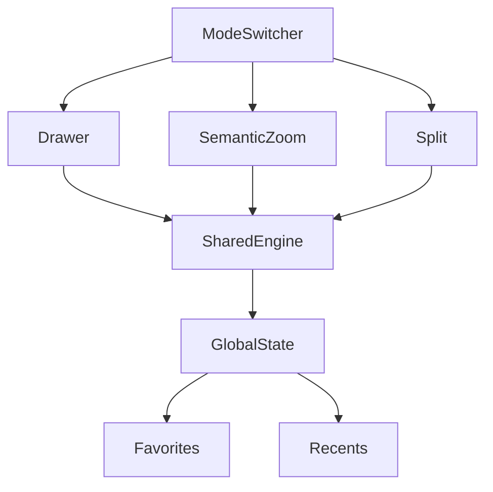

# Visualization Modes – Concept Overview

We’ll ship three layout modes—Drawer Explorer, Semantic Zoom + Drill‑in, and Split View—so different users can work the way they think, while sharing one fast map engine and one global state.

## Why
- Reduce overwhelm without hiding power.
- Keep spatial context, but surface files when needed.
- Support fast jumps via Favorites and Recents across all modes.

## The three modes
1) Drawer Explorer
   - Click a station → right‑side drawer shows its files/folders.
   - Pros: minimal layout shift; great on small screens.
   - Cons: can feel cramped for deep folders.
2) Semantic Zoom + Drill‑in
   - Progressive disclosure by zoom thresholds with transient overlays.
   - Pros: scales to huge projects; power‑user friendly.
   - Cons: requires learning thresholds; careful overlay design.
3) Split View
   - Persistent map + file browser with resizable splitter.
   - Pros: easiest to discover; great for compare and drag‑drop.
   - Cons: needs horizontal space; can feel busy.

## Always‑on fast navigation
- Favorites: pin key stations; jump instantly; reorder; label.
- Recents: automatic list of last visits (LRU, capped).
- Works even if filters would hide a target (temporary reveal + toast).
- Keyboard: Ctrl/Cmd+K Quick Switcher; F to favorite; Ctrl+Shift+1..9 to jump.

## What stays shared (not re‑implemented per mode)
- Rendering engine (pan/zoom, culling, GPU safety): <mcfile name="metro-stage.tsx" path="d:\Users\paulo\Documents\GitHub\CircuitExp1\src\visualization\stage\metro-stage.tsx"></mcfile>
- Global state (selection, hover, zoom, filters, fileView, favorites, recents): UI store/context.
- Persistence and telemetry: <mcfile name="favorites-store.cjs" path="d:\Users\paulo\Documents\GitHub\CircuitExp1\favorites-store.cjs"></mcfile> <mcfile name="recent-scans-store.cjs" path="d:\Users\paulo\Documents\GitHub\CircuitExp1\recent-scans-store.cjs"></mcfile> <mcfile name="telemetry.ts" path="d:\Users\paulo\Documents\GitHub\CircuitExp1\src\services\telemetry.ts"></mcfile>

## Success criteria (MVP)
- Switch modes with zero loss of selection/filters/zoom.
- Favorites/Recents jumps are instant and reliable.
- A11y: keyboard and focus behavior consistent across modes.
- No regressions in render performance or stability.

## Decisions we’ll finalize together
- Default mode (recommend Split View for discoverability).
- Zoom thresholds for semantic layers.
- Recents size and retention.
- Deep‑linking format (?mode=split&go=station:ID).

## Next steps
- Implement mode registry and thin shells, wire global switcher.
- Unify Favorites/Recents navigation via a shared goToStation API.
- Add Quick Switcher; polish overlay/drawer/split shells iteratively.

## Mouse-only mode selection
- The three visualization modes — Drawer, Semantic Zoom, and Split View — can be selected exclusively via the on-screen Mode Switcher (segmented buttons) in the application header.
- Keyboard-based mode switching is intentionally disabled; use the mouse to click the desired mode.
- URL deep links (e.g., `?mode=drawer|zoom|split`) are still respected on load, but switching after load is mouse-only.
