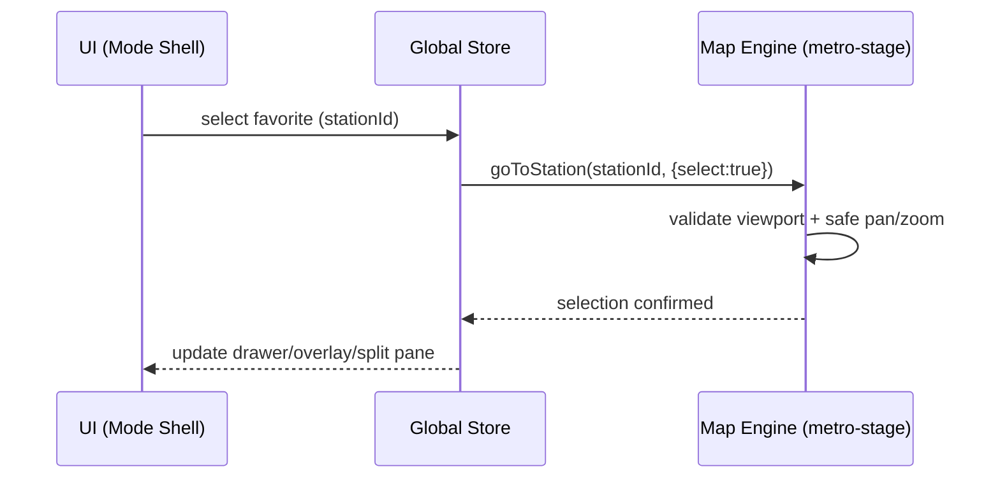

# Visualization Modes – Integration Plan (Full)

Goal: Adopt three complementary modes—Drawer Explorer, Semantic Zoom + Drill‑in, and Split View—so users can switch layouts instantly without losing context, while preserving fast navigation via Favorites and Recents.

## Scope (MVP)
- Mode registry + global switcher (no visual churn to the map engine).
- Shared state persists across modes: selection, hover, zoom, filters, file view, favorites, recents.
- Unified navigation API: goToStation, selectStation, drillIn/out.
- Deep‑linking: /viz?mode=split&go=station:ID (optional in MVP).

## System overview
```mermaid
flowchart LR
  A[App Shell<br/>(App.tsx)] --> B[Top UI<br/>(MetroUI.tsx)]
  B --> C[Mode Switcher]
  C --> D1[Drawer Shell]
  C --> D2[Semantic Zoom Shell]
  C --> D3[Split View Shell]
  D1 & D2 & D3 --> E[Shared Map Engine<br/>(metro-stage.tsx)]
  E --> F[Pan/Zoom, Culling, GPU Safety]
  B --> G[Global Store<br/>Selection/Zoom/Filters/Fav/Recents]
  G <--> E
```

Key code touchpoints:
- Shell/UI: <mcfile name="MetroUI.tsx" path="d:\Users\paulo\Documents\GitHub\CircuitExp1\src\components\MetroUI.tsx"></mcfile> <mcfile name="MetroLineDemo.tsx" path="d:\Users\paulo\Documents\GitHub\CircuitExp1\src\components\MetroLineDemo.tsx"></mcfile>
- Engine: <mcfile name="metro-stage.tsx" path="d:\Users\paulo\Documents\GitHub\CircuitExp1\src\visualization\stage\metro-stage.tsx"></mcfile>
- Persistence & telemetry: <mcfile name="favorites-store.cjs" path="d:\Users\paulo\Documents\GitHub\CircuitExp1\favorites-store.cjs"></mcfile> <mcfile name="recent-scans-store.cjs" path="d:\Users\paulo\Documents\GitHub\CircuitExp1\recent-scans-store.cjs"></mcfile> <mcfile name="telemetry.ts" path="d:\Users\paulo\Documents\GitHub\CircuitExp1\src\services\telemetry.ts"></mcfile>

## Unified navigation (Favorites/Recents)
- Favorites: persistent set by stationId; label/notes; reorderable.
- Recents: LRU list with timestamps; capped (e.g., 50); dedup adjacent.
- Behavior: jump works even if filters hide the target (temporary reveal with toast + Restore).



## Mode definitions (Strategy)
- Drawer: right‑side file drawer bound to selection; minimal layout shift.
- Semantic Zoom: thresholded layers + transient drill‑in overlays.
- Split View: persistent two‑pane with resizable splitter and bidirectional selection sync.

## Data and state
- Single source: selection, hover, zoom, filters, fileView, favorites, recents.
- Persist: URL params + localStorage; restore on load.

## Accessibility & keyboard
- Esc closes drawer/overlay; focus returns to origin; visible focus rings.
- Quick Switcher (Ctrl/Cmd+K) lists stations, favorites, recents; Enter to jump.
- Shortcuts: F toggle favorite; Ctrl+Shift+1..9 quick favorites; Alt+←/→ history.

## Performance
- Keep engine shared; modes are thin shells.
- Lazy‑load shells; prefetch likely assets after idle.
- Reuse GPU safety and viewport validation in stage.

## Risks and mitigations
- Behavior drift across modes → centralize contracts in engine/store; tests.
- Bundle bloat → dynamic import per mode; tree‑shake.
- Hidden targets (filters) → consistent temporary reveal flow + toast.
- HMR/refresh regressions → snapshot tests per mode; perf baselines.

## Phased rollout
1) Registry + shells: implement mode interface, lift existing UIs behind shells; switcher in UI.
2) Navigation API: goToStation/selectStation wired; favorites/recents persistence unified.
3) Deep‑link + state restore; temporary filter‑override UX.
4) Theme switcher decoupled from modes; tokens for color/density.
5) Tests: a11y smoke, E2E flows, perf baselines; gradual feature flag.

## Acceptance criteria
- Mode switch preserves selection, filters, zoom within 1 frame.
- Favorite/Recent jump locates and selects station within 300–800ms; works despite filters.
- Keyboard flows and Quick Switcher work in all modes.
- No WebGPU/resize regressions during rapid jumps/zoom.

## Open decisions
- Default mode (recommend Split View).
- Recents cap (50?) and retention policy.
- Semantic thresholds for drill‑in layers.
- MiniMap pins for favorites (on/off by default).

## Mode switch UX (mouse-only)
- Provide a segmented control in the header with three options: Drawer, Semantic Zoom, Split View.
- Activation is via mouse click; keyboard activation is disabled by design for mode changes.
- Maintain support for URL initialization via `?mode=...` and persist last-used mode, but runtime switching uses the mouse control.
